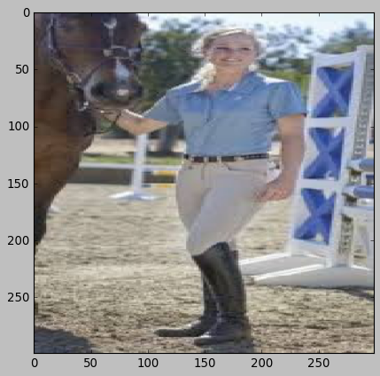
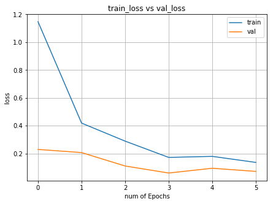
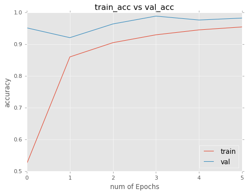

# Transfer Learning Models

VGG16 and InceptionV3 models are trained on [ImageNet](http://www.image-net.org/) dataset.  
These pretrained models can be used to train on custom image dataset and add some layers to fine tune the models. It transfers the knowledge from one dataset to another dataset which are similar.

# Dataset

  - Custom image dataset of 4 categories

# Tools

- **Jupyter Notebook**

# Description
- 2 image classification models are used for transfer learning, **VGG16** and **InceptionV3**
- Sample image  

- InceptionV3 Train loss vs validation loss  

- InceptionV3 train accuracy vs validation accuracy  

